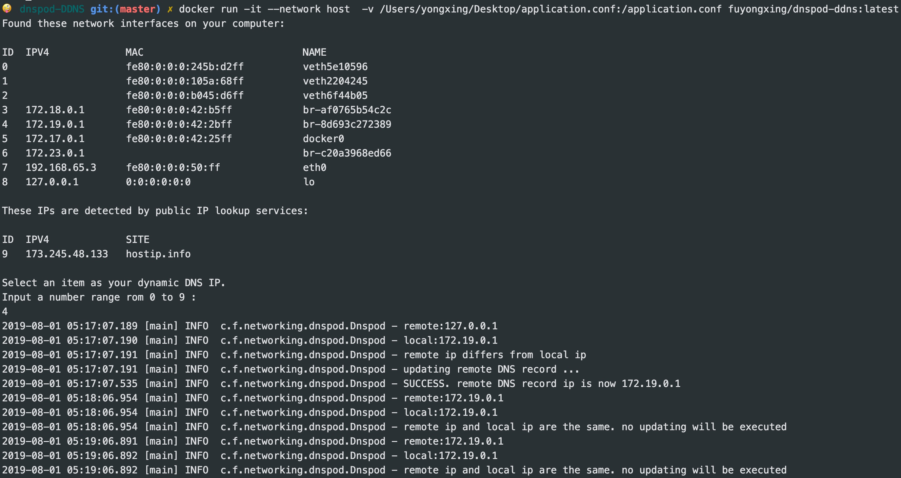

# dnspod-DDNS
A Kotlin implementation of dynamic DNS client working with https://dnspod.cn

* Docker image can be found at [fuyongxing/dnspod-ddns](https://cloud.docker.com/repository/docker/fuyongxing/dnspod-ddns/general)
* This project is built on top of [Kotlin](https://github.com/JetBrains/kotlin), [Retrofit](https://github.com/square/retrofit), [RxKotlin](https://github.com/ReactiveX/RxKotlin) and [lightbend/config](https://github.com/lightbend/config)

# Example


# Quick start with docker
`docker run -it --network host -v YOUR_CONFIG_FILE:/app/application.conf fuyongxing/dnspod-ddns`

* `--network host` ensures host network interfaces can be detected by docker container
* [YOUR_CONFIG_FILE](application.conf) stores your api-key and domain in the following format
```
dnspod {
  apiId = 7xxx1
  apiKey = 4xxxxxxxxxxxxxxxxxxxxxxxxxxxxxx6
  domain = fxxxxxxxxg.com
  subDomain = dxv
}
```

# Build Jar file
* requires JDK 8+

run `./gradlew distTar`, and `.jar` file will be included in build/distributions/dnspod-DDNS-x.x.x.tar

# Build Docker image
run `docker build -t fuyongxing/dnspod-ddns .`