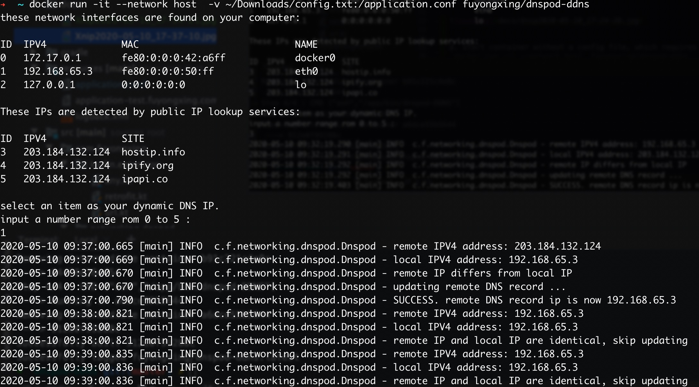
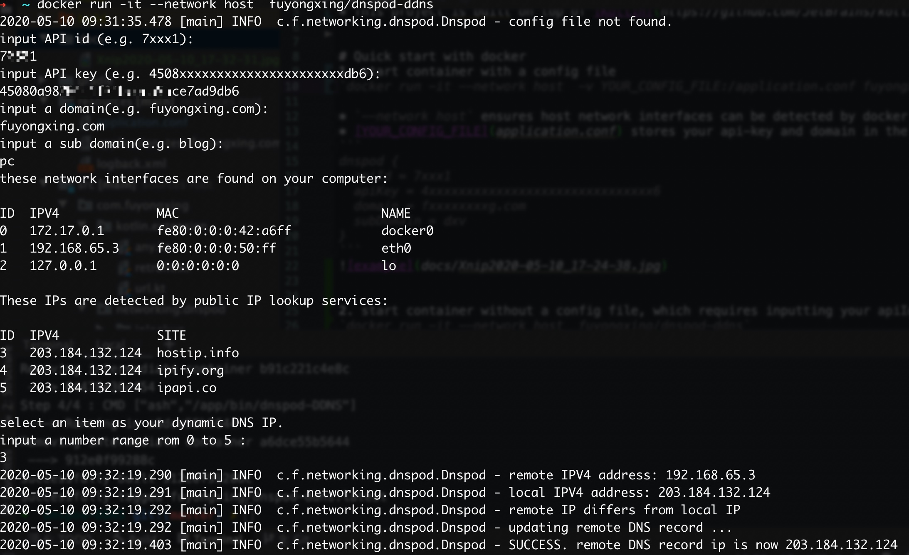

# dnspod-DDNS
A Kotlin implementation of dynamic DNS client working with https://dnspod.cn

* Docker image can be found at [Docker Hub](https://hub.docker.com/r/fuyongxing/dnspod-ddns)
* This project is built on top of [Kotlin](https://github.com/JetBrains/kotlin) and [Retrofit](https://github.com/square/retrofit)


# Quick start with docker
## start container with a config file

`docker run -it --network host  -v YOUR_CONFIG_FILE:/application.conf fuyongxing/dnspod-ddns`

* `--network host` ensures host network interfaces can be detected by docker container
* [YOUR_CONFIG_FILE](docs/application.conf) stores your api-key and domain in the following format
```
dnspod {
  apiId = 7xxx1
  apiKey = 4xxxxxxxxxxxxxxxxxxxxxxxxxxxxxx6
  domain = fxxxxxxxxg.com
  subDomain = dxv
}
```



## start container without a config file, which requires inputting your apiId in interactively.

`docker run -it --network host  fuyongxing/dnspod-ddns`
* `--network host` ensures host network interfaces can be detected by docker container


# Build Jar file
* requires JDK 8

run `./gradlew distTar`, and a `.jar` file will be presented at build/distributions/dnspod-DDNS-x.x.x.tar

# Build a Docker image
run `docker build -t fuyongxing/dnspod-ddns .`
